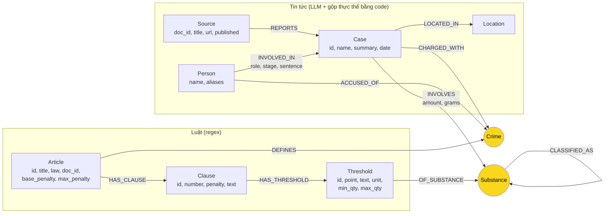

# Thiết kế Ontology — Day 19

**Họ tên:** Nguyễn Lê Ngọc Bảo  **MSSV:** 2A202602852

**Lựa chọn** (đánh dấu một):
- [ ] Dùng ontology gợi ý (có thể chỉnh nhỏ)
- [x] Tự thiết kế (xét bonus +15, xem `SUBMISSION.md`)

> Code: `src/graph.py`, hàm `_build_graph_own` (dựng) và `Neo4jGraph._context_own` (truy vấn).
> Ontology gợi ý vẫn giữ nguyên trong code để làm baseline: đặt biến môi trường `KG_ONTOLOGY=hint`
> rồi chạy `python bench_kg.py --judge --out ket_qua_benchmark_kg.hint.txt`.
> Mọi số liệu "của tôi" dưới đây lấy từ graph ứng với `ket_qua_benchmark_kg.txt` (339 node / 624 cạnh).

## 1. Sơ đồ

Hai **node cầu nối** (tô vàng): `Crime` (cầu chính) và `Substance` (cầu thứ hai, nối khối lượng trong vụ án với ngưỡng trong khoản luật).

## 2. Entity types (node labels)

Số lượng trong graph thật (truy vấn Q-A, ảnh `img/kg_count.png`): Threshold 116, Clause 99, Person 35, Source 20, Substance 19, Article 18, Crime 13, Case 12, Location 7.

| Label | Ý nghĩa | Khóa định danh (`MERGE` theo) | Properties | Lấy từ KB nào | Trích bằng |
| --- | --- | --- | --- | --- | --- |
| `Article` | Một Điều luật | `id` ("Điều 251 BLHS") | `title`, `law`, `doc_id`, `base_penalty`, `max_penalty` | luật | regex (`parse_law_article_own`) |
| `Clause` | Một khoản của Điều | `id` ("Điều 251 BLHS khoản 1") | `number`, `penalty`, `text`, `doc_id` | luật | regex |
| `Threshold` | Một điểm của khoản có nêu **ngưỡng khối lượng** cho chất cụ thể | `id` ("Điều 250 BLHS khoản 4 điểm b") | `point`, `text`, `unit` (g/ml), `min_qty`, `max_qty` (null = "trở lên"), `doc_id` | luật | regex (`parse_thresholds`) |
| `Crime` | Tội danh (**cầu nối chính**) | `name` đã chuẩn hóa ("mua bán trái phép chất ma túy") | — | luật (tiêu đề Điều); tin chỉ được nối vào tên có sẵn | regex + `link_entity` |
| `Substance` | Chất ma túy (**cầu nối thứ hai**) | `name` chuẩn theo cách BLHS viết ("MDMA", "cần sa") | `aliases` (tên báo hay dùng: "thuốc lắc", "kẹo") | cả hai | bảng `SUBSTANCE_ALIASES` + `link_substance` |
| `Source` | Một bài báo | `doc_id` | `title`, `url`, `published` | tin | metadata file, không cần LLM |
| `Case` | Một vụ việc ngoài đời (có thể được **nhiều bài** đưa tin) | `id` = "case:" + tên bị can/bị cáo chính đã chuẩn hóa; vụ không có người thì "case:&lt;doc_id&gt;:&lt;tên vụ&gt;" | `name`, `summary`, `date` | tin | LLM + `resolve_cases` |
| `Person` | Người trong vụ việc | `name` (họ tên thật; biệt danh chỉ là alias) | `aliases` | tin | LLM + `resolve_cases` |
| `Location` | Tỉnh/thành | `name` | — | tin | LLM |

`doc_id` có trên mọi node sinh ra từ **đúng một** tài liệu (`Article`, `Clause`, `Threshold`, `Source`). `Crime`, `Substance`, `Case`, `Person`, `Location` là node dùng chung giữa nhiều tài liệu nên cố ý không có `doc_id`; bài báo nào nói về vụ nào được ghi bằng cạnh `REPORTS`.

## 3. Relationships

| Type | Từ → Đến | Properties trên cạnh | Ý nghĩa | Số cạnh |
| --- | --- | --- | --- | --- |
| `DEFINES` | Article → Crime | — | Điều luật quy định tội danh | 13 |
| `HAS_CLAUSE` | Article → Clause | — | Điều có khoản | 99 |
| `HAS_THRESHOLD` | Clause → Threshold | — | Khoản có điểm nêu ngưỡng khối lượng | 116 |
| `OF_SUBSTANCE` | Threshold → Substance | — | Ngưỡng áp dụng cho chất nào | 272 |
| `CLASSIFIED_AS` | Substance → Substance | — | Chất BLHS không gọi tên (Ketamine) thuộc nhóm "chất ma túy khác ở thể rắn" | 1 |
| `REPORTS` | Source → Case | — | Bài báo đưa tin về vụ việc | 19 |
| `CHARGED_WITH` | Case → Crime | — | Vụ việc có tội danh (hợp của tội danh từng người) | 15 |
| `INVOLVES` | Case → Substance | `amount` (nguyên văn báo), `grams` (số, null nếu không quy đổi được) | Tang vật | 15 |
| `LOCATED_IN` | Case → Location | — | Nơi xảy ra/xét xử | 11 |
| `INVOLVED_IN` | Person → Case | `role`, `stage` (giai đoạn tố tụng), `sentence` | Vai trò của người trong vụ | 35 |
| `ACCUSED_OF` | Person → Crime | — | Tội danh của **riêng** người đó | 28 |

## 4. Node cầu nối giữa 2 KB

- **Node nào:** `Crime` là cầu chính; `Substance` là cầu thứ hai.
- **Vì sao chọn node này:** tội danh là khái niệm duy nhất mà cả hai KB đều nói tới bằng cùng một cụm từ: luật *định nghĩa* nó (tiêu đề Điều), báo *quy kết* nó cho người/vụ. Tên người, mức án chỉ có ở báo; số Điều, khung hình phạt chỉ có ở luật. `Substance` được thêm làm cầu thứ hai vì câu hỏi "khối lượng này rơi vào khoản nào" (Q5) không trả lời được chỉ bằng tội danh: phải so `INVOLVES.grams` của vụ với `Threshold.min_qty/max_qty` của **cùng chất**.
- **Cách đảm bảo hai phía khớp tên:**
  1. Danh sách tội danh chuẩn (13 tên, lấy từ tiêu đề Điều bằng regex) được đưa vào prompt trích xuất.
  2. LLM không luôn tuân thủ, nên mọi tội danh trả về vẫn đi qua `link_entity` (chuẩn hóa NFC, bỏ tiền tố "Tội", chữ thường; khớp chính xác trước, rồi `difflib` cutoff 0.8; không đủ giống thì bỏ, không đoán).
  3. Chất: `link_substance` tra bảng alias (`kẹo`/`thuốc lắc` → `MDMA`, `ma túy đá` → `Methamphetamine`…), chuẩn hóa cả vị trí dấu kiểu cũ (`ma tuý` = `ma túy`). Phía luật dùng bảng cụm từ riêng (`LAW_SUBSTANCE_PHRASES`) để "cây cần sa" và "nhựa cần sa" không bị nhập làm một.
  4. `Crime` chỉ được **tạo** từ phía luật; phía tin chỉ `MERGE` vào tên đã qua `link_entity`, nên không thể sinh ra một `Crime` mồ côi làm tách đôi cầu.
- **Khi nào cầu gãy, và xử lý thế nào:**
  - Bài báo không nêu tội danh thuộc Chương XX (vụ tài xế dùng ma túy tông CSGT ở An Giang bị khởi tố tội khác) → vụ không có `CHARGED_WITH`. Đây là gãy **đúng**: nối bừa vào một tội ma túy sẽ sai. Trong `context()`, vụ như vậy vẫn cho dữ kiện phía tin, chỉ không có phần luật.
  - LLM viết tội danh quá khác tên chuẩn (dưới cutoff 0.8) → bị bỏ. Giảm thiểu bằng quy tắc "tội ghép thì tách" trong prompt, và lấy **hợp** tội danh ở hai mức (vụ + từng người): chỉ cần một trong hai chỗ ghi đúng là cầu còn.
  - Cầu `Substance` gãy khi báo không nêu khối lượng quy đổi được ("5 viên", "nửa chỉ") hoặc không nêu loại chất ("hơn 36kg ma túy") → `grams` null hoặc chất là `ma túy (không rõ loại)`, không có ngưỡng nào khớp. Khi đó `context()` vẫn trả **toàn bộ thang hình phạt** của Điều (mỗi khoản một dòng), để LLM không bị thiếu khung; chỉ thiếu kết luận "áp dụng khoản nào".

## 5. Competency questions

| Câu | Đường đi (Cypher pattern) | Trả lời được? |
| --- | --- | --- |
| Q1 | `(:Article {id:'Điều 2 Luật PCMT'})-[:HAS_CLAUSE]->(:Clause)`: định nghĩa "tiền chất" nằm trong `Clause.text` | **Graph không dùng để trả lời.** Câu 1 bước trong một đoạn văn; vector search đã đủ. `context()` trả về 0 dữ kiện cho câu này, nên GraphRAG gần như không tốn thêm token (0,00013 so với 0,00012 USD) |
| Q2 | `(:Source {doc_id})-[:REPORTS]->(k:Case)<-[r:INVOLVED_IN]-(p:Person) WHERE r.sentence = 'tử hình'` | Được (Trần Thanh Tuấn, Trần Minh Tâm) |
| Q3 | `(:Person {name:'Lê Minh Thành'})-[r:INVOLVED_IN {sentence}]->(:Case)`, rồi `(p)-[:ACCUSED_OF]->(:Crime)<-[:DEFINES]-(a:Article {base_penalty})` | Được: 36 tháng tù → mua bán trái phép chất ma túy → Điều 251 → `base_penalty` = "phạt tù từ 02 năm đến 07 năm" |
| Q4 | `(p:Person) WHERE 'Hoàng Nato' IN p.aliases`, rồi `(p)-[:ACCUSED_OF]->(:Crime)<-[:DEFINES]-(a:Article {max_penalty})` | Được: Dương Minh Tuấn → tổ chức sử dụng trái phép chất ma túy → Điều 255 → `max_penalty` = "phạt tù 20 năm hoặc tù chung thân" |
| Q5 | `(:Person {name:'Cái Quang Huy'})-[:INVOLVED_IN]->(k:Case)-[i:INVOLVES]->(s:Substance {name:'MDMA'})<-[:OF_SUBSTANCE]-(t:Threshold)<-[:HAS_THRESHOLD]-(cl:Clause)<-[:HAS_CLAUSE]-(a:Article)-[:DEFINES]->(:Crime)<-[:ACCUSED_OF]-(p) WHERE t.min_qty <= i.grams AND (t.max_qty IS NULL OR i.grams < t.max_qty)` | Được, và graph **tự tính** ra khoản: 9600 g ≥ 100 g → điểm b khoản 4 Điều 250 → "phạt tù 20 năm, tù chung thân hoặc tử hình" |
| Q6 | `(:Substance {name:'MDMA'})<-[:INVOLVES]-(k:Case)<-[:REPORTS]-(:Source)` | Được: trả về 4 vụ (3 vụ trong đáp án chuẩn + vụ Hoàng Nato, bài báo có nhắc "thuốc lắc"). Đây là câu vector search không thể đủ vì top-3 chunk chỉ chạm 1–2 bài |

Câu ontology này **không** trả lời được (chấp nhận, ngoài phạm vi 6 câu): tình tiết định khung không phải khối lượng ("có tổ chức", "phạm tội 02 lần trở lên", "qua biên giới") chưa được mô hình hóa, nên graph không suy ra được khoản 2 Điều 251 cho một vụ có tổ chức; thông tin đó vẫn nằm trong `Clause.text` nhưng không có cạnh nào nối tới vụ án.

## 6. Quyết định thiết kế và đánh đổi

1. **Ngưỡng khối lượng là node `Threshold` riêng, không phải cạnh `Clause -MENTIONS-> Substance`.**
   Phương án khác: (a) giữ `MENTIONS` như gợi ý; (b) nhét min/max vào property của `Clause`. (a) chỉ nói "khoản này có nhắc MDMA", mà khoản 1, 2, 3, 4 Điều 250 **đều** nhắc MDMA, nên không chọn được khoản; (b) không được vì một khoản có nhiều ngưỡng cho nhiều nhóm chất. Chọn node riêng vì so sánh số trở thành một mệnh đề `WHERE` trong Cypher. Đánh đổi: thêm 116 node + 388 cạnh (graph to hơn 1,65 lần baseline), nhưng **prompt lại ngắn hơn** vì không còn phải chép nguyên văn 4 khoản (xem mục 7).
2. **`Case` là thực thể ngoài đời, tách khỏi bài báo (`Source`), và được gộp bằng code theo bị can/bị cáo chung.**
   Phương án khác: (a) `Case` khóa theo tên LLM đặt (gợi ý); (b) nhờ LLM so từng cặp vụ để gộp. (a) cho 4 node `Case` khác nhau cho cùng vụ Hoàng Nato; (b) tốn O(n²) lần gọi LLM và không lặp lại được. Chọn union-find trên tên người đã chuẩn hóa: 0 token, kết quả ổn định. Đánh đổi: gộp **nhầm** nếu hai vụ khác nhau có bị cáo trùng họ tên, và **không gộp được** vụ mà bài báo không nêu tên ai (xem lỗi E3 trong báo cáo).
3. **Khung hình phạt cơ bản/cao nhất là property của `Article`, và `context()` trả thang hình phạt rút gọn (mỗi khoản một dòng `penalty`) thay vì nguyên văn khoản.**
   Phương án khác: quy tắc của gợi ý (khoản 1 + khoản nào nhắc chất của vụ). Quy tắc đó hụt với tội không phụ thuộc chất (Điều 255: không khoản nào nhắc chất → chỉ có khoản 1 → trả lời sai "tối đa 7 năm"). Chọn tính sẵn bằng regex lúc dựng: rẻ, và câu "tối đa" đọc thẳng từ một property. Đánh đổi: mất nội dung chi tiết của từng điểm trong prompt; câu hỏi về tình tiết cụ thể phải dựa vào chunk vector.
4. **Tội danh gắn ở cả hai mức: `Case -CHARGED_WITH-> Crime` và `Person -ACCUSED_OF-> Crime`.**
   Phương án khác: chỉ ở mức vụ, tội của từng người là chuỗi `charge` trên cạnh (gợi ý). Vụ Hoàng Nato có 3 tội danh ở mức vụ nhưng riêng Dương Minh Tuấn chỉ bị bắt về "tổ chức sử dụng"; nếu chỉ có mức vụ, Q4 sẽ kéo cả Điều 249 và 251 (khung cao nhất là tử hình) vào prompt và dễ trả lời sai. Đánh đổi: thêm 28 cạnh; phải giữ hai mức nhất quán (code lấy hợp).
5. **Chỉ quy đổi khối lượng khi chắc chắn.** `grams` chỉ có khi báo ghi đơn vị kg/g cho **riêng** chất đó; một con số gán cho nhiều chất ("khoảng 100g ma túy tổng hợp các loại") bị coi là tổng chung và để null. Phương án khác: chia đều hoặc gán cho từng chất → sinh ra kết luận "áp dụng khoản 4" không có cơ sở. Đánh đổi: chỉ 6/15 cạnh `INVOLVES` có `grams`.

## 7. So với ontology gợi ý (bắt buộc nếu xét bonus)

Baseline: `ket_qua_benchmark_kg.hint.txt` (ontology gợi ý, cùng model, cùng dữ liệu, cùng 6 câu). Của tôi: `ket_qua_benchmark_kg.txt`.

| Chỉ số GraphRAG | Gợi ý | Của tôi |
| --- | --- | --- |
| recall trung bình | 0,83 | **1,00** |
| judge trung bình | 1,67 | **2,00** |
| in_tok mỗi câu | 3704 | **2135** (−42%) |
| USD mỗi câu | 0,00059 | **0,00036** (−39%) |
| USD indexing | 0,00931 | 0,01123 (+21%) |
| Kích thước graph | 205 node / 381 cạnh | 339 node / 624 cạnh |

| Điểm khác | Gợi ý làm gì | Tôi làm gì | Vấn đề nó giải quyết | Bằng chứng |
| --- | --- | --- | --- | --- |
| **Ngưỡng khối lượng** | `Clause -MENTIONS-> Substance`: chỉ biết khoản có nhắc chất | `Clause -HAS_THRESHOLD-> Threshold {min_qty, max_qty} -OF_SUBSTANCE-> Substance`, `INVOLVES.grams` | Graph chọn đúng **một** khoản theo khối lượng, thay vì đưa cả 4 khoản cho LLM tự so | Trước: truy vấn theo quy tắc gợi ý cho Cái Quang Huy trả về khoản 1, 2, 3, 4 Điều 250 (1328 + 1220 + 1014 + 928 = 4490 ký tự nguyên văn). Sau: truy vấn Q5 ở mục 5 trả về đúng 1 dòng `{article: 'Điều 250 BLHS', khoan: 4, diem: 'b', grams: 9600.0, min: 100.0}`. Chi phí Q5: 0,00098 → 0,00031 USD |
| **Khung cao nhất** | Chỉ lấy khoản 1 + khoản nhắc chất của vụ | `Article.base_penalty`, `Article.max_penalty` + thang hình phạt rút gọn | Câu hỏi "tối đa" với tội không phụ thuộc chất | Q4 baseline: *"có thể bị phạt tù tối đa 7 năm theo Điều 255 BLHS"* (recall 0,67, judge 1). Q4 của tôi: *"tối đa 20 năm hoặc tù chung thân theo Điều 255"* (recall 1,00, judge 2) |
| **Gộp vụ việc qua nhiều bài** | `Case` khóa theo tên LLM đặt, `doc_id` của 1 bài | `Source -REPORTS-> Case`; `resolve_cases` gộp các vụ có chung bị can/bị cáo | Một vụ ngoài đời thành nhiều node | Trước: `MATCH (p:Person)-[:INVOLVED_IN]->(k:Case) WHERE 'Hoàng Nato' IN p.aliases RETURN k.name` → **4** vụ khác tên. Sau: 1 `Case` (`case:dương minh tuấn`) có 5 cạnh `REPORTS`. Tổng: 14 `Case` → 12 |
| **Gộp tên chất** | `MERGE` theo chuỗi LLM trả về | Bảng alias + `link_substance`, chuẩn hóa hoa/thường và vị trí dấu | Trùng thực thể làm câu tổng hợp thiếu | Trước: `MATCH (s:Substance) RETURN s.name` có `cần sa`/`Cần sa`, `Ketamine`/`ketamine`, `Methamphetamine`/`methamphetamine`, `thuốc lắc` (tách khỏi `MDMA`), `ma túy`/`chất ma túy`. Sau: không còn cặp nào. Q6 baseline recall 0,33 → 1,00 |
| **Tội danh theo người** | Chuỗi `charge` trên cạnh `INVOLVED_IN` | Cạnh `Person -ACCUSED_OF-> Crime` | Đồng phạm khác tội danh; đi Person → Article trong 2 bước | Vụ Hoàng Nato có 3 `CHARGED_WITH` nhưng `context()` cho Q4 chỉ đưa Điều 255 vào prompt (0,00030 USD) |
| **Giai đoạn tố tụng** | Không có | `INVOLVED_IN.stage` | Phân biệt "chưa có án" với "LLM bỏ sót án" | `MATCH (:Person)-[r:INVOLVED_IN]->() RETURN r.stage, count(*), sum(CASE WHEN r.sentence='' THEN 1 ELSE 0 END)`: bắt giữ 11/11 không có án (hợp lý), khởi tố 6/6 (hợp lý), xét xử sơ thẩm 5/15 (cần xem lại, lỗi E6) |
| **Chất ngoài danh mục BLHS** | Ketamine không nối tới khoản nào | `Ketamine -CLASSIFIED_AS-> chất ma túy khác ở thể rắn` | Chất BLHS không gọi tên vẫn có ngưỡng | `context()` cho Q5 có dòng "Ketamine gần 406g (= 406 gam) … thuộc điểm e khoản 4 Điều 250 BLHS" |

**Competency question mà gợi ý trả lời sai/thiếu còn ontology này trả lời đúng:** Q4 (sai khung cao nhất: 7 năm thay vì 20 năm/chung thân) và Q6 (thiếu tên vụ: recall 0,33; gọi vụ Viện Pháp y là "vụ tổ chức sử dụng ma túy tại Sầm Sơn" và không nêu tên Lê Minh Thành). Q5 baseline trả lời đúng nhưng tốn 3,2 lần chi phí vì LLM phải tự so khối lượng trên nguyên văn 4 khoản.

Cách tái lập các truy vấn "Trước": dựng graph baseline bằng `KG_ONTOLOGY=hint python bench_kg.py --build` rồi chạy truy vấn trong Neo4j Browser. Tôi chạy chúng trên một lần dựng baseline riêng (205 node / 383 cạnh, 14 `Case`), không phải đúng lần dựng trong `ket_qua_benchmark_kg.hint.txt` (205 node / 381 cạnh), vì mỗi lần `bench_kg.py` chạy đều xóa graph cũ.

Lưu ý khi đọc bảng: hai lần chạy là hai lần trích xuất LLM độc lập, nên một phần chênh lệch có thể đến từ dao động của LLM chứ không chỉ từ ontology; mỗi cấu hình mới chạy 1 lần trên 6 câu.

## 8. Hạn chế còn lại

- **Vụ không nêu tên người thì không gộp được.** Đoạn "tin liên quan" cuối bài `news-100260924101703641` sinh ra `Case` "Vụ tiệc ma túy trên bãi biển Sầm Sơn" (0 người, 0 tội danh), thực chất là vụ Viện Pháp y tâm thần. Còn 5/12 `Case` không có người nào.
- **Gộp theo tên người có thể gộp nhầm** hai vụ khác nhau nếu trùng họ tên; chưa dùng tuổi/quê quán để phân biệt.
- **Chỉ 6/15 cạnh `INVOLVES` có `grams`**: "5 viên", "nửa chỉ", "1.000 đầu pod" không quy đổi được; "hơn 36kg ma túy" không rõ loại nên không có ngưỡng.
- **Tình tiết định khung phi khối lượng** (có tổ chức, tái phạm nguy hiểm, qua biên giới…) chưa là node; điểm "có 02 chất ma túy trở lên" (cộng dồn tỉ lệ) cũng chưa tính.
- **Alias quá chung**: LLM vẫn trả "bà trùm", "TikToker Phannhibeauty" làm biệt danh; alias chung chung có thể khớp nhầm câu hỏi khác.
- **Tội ngoài Chương XX bị bỏ** (đưa/nhận hối lộ trong vụ Viện Pháp y) vì KB luật không có Điều tương ứng; 4 người "cán bộ, khởi tố" trong vụ này không có `ACCUSED_OF`.
- `stage` là giá trị LLM tự chọn, chưa ép về tập đóng (có "truy nã", "không bị khởi tố").
